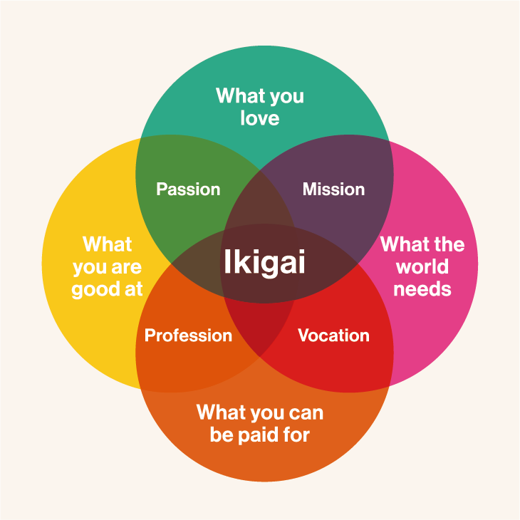
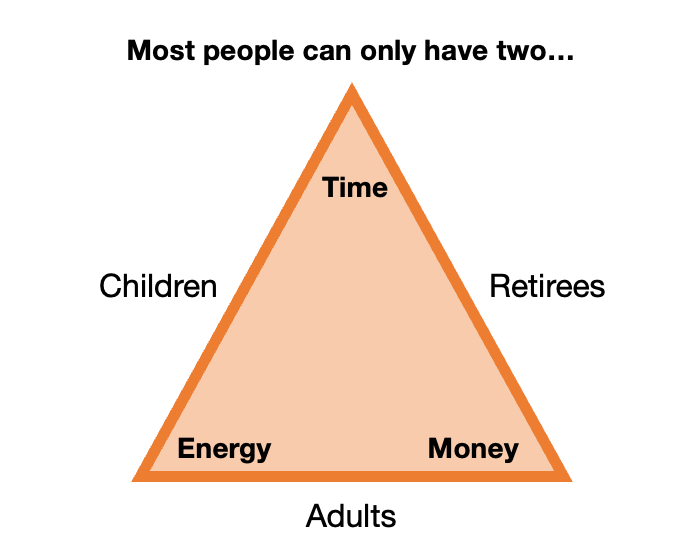

# Unlocking My Ikigai: Could It Be More than Just "Feeling Good"?

Ever stop and wonder, "What's the point of it all?" Lately, I've been grappling with that question, exploring the concept of Ikigai – the Japanese philosophy of finding your "reason for being." You know, the sweet spot where your passion, mission, profession, and vocation all overlap. 

While life feels pretty good right now, a nagging feeling persists: Is this it? Have I found my Ikigai? Maybe in another post. But what got me thinking is, what if happiness and fulfillment come with asking a different question: "Why now?"

Think about it. We often make life choices on autopilot, without questioning the timing. But what if the "when" matters just as much as the "what"?

# Investing in Yourself: Experiences & Time - Why Now Matters
Ever feel stuck in a rut, yearning for something more meaningful? 
You're not alone. 
We all have areas of life where the answer to the *"Why now?"* question can unlock hidden potential. 
Imagine waking up excited for the future, knowing you're actively pursuing your dreams. 
The answer to *"Why now?"* can be your guiding principle to that reality. 
What's one area of your life where by asking "Why do -something- now?" could open doors to joy, fulfillment, or a fresh start? 
Share your honest answer in the comments below – maybe we can help each other take that leap!

## Example 1: "Why start saving money now?"
Take saving money, for example. Remember my post about values vs. money?  Starting at 25 instead of 35 can double your retirement savings, even after accounting for the initial investment! Why wait? The power of compounding works the same way for experiences. Early adventures build memories, skills, and wisdom that pay off later.

## Example 2: "Why travel now?"
I have a long-term ambition to visit every country in the world. 
To be CLEAR (Concise, Limited, Elaborate, Attainable, Relevant), my first milestone towards this goal, is exploring all countries with a population exceeding the Netherlands' by my 30th birthday.

To prioritize safety, I focus on destinations deemed relatively secure by the Dutch government, avoiding "red" zones ([Example of zones.](https://www.nederlandwereldwijd.nl/reisadvies/marokko)). This approach feels sensible at this stage in my life, considering I am young. Additionally, I believe maturity and experience gained with age will equip me to navigate potentially trickier situations during future travels.

So, why travel now?
To achieve this goal, you just need a lot of time, money and energy.
 
This "triangle of life" illustrates the point. While your money and time fluctuate, your energy is a precious, limited resource. It fuels experiences that at a older age are just not possible.

## Example 3: "Why spend energy now?"
Just like compounding interest, experiences accumulate value over time. This wisdom gained through, for example early travels will equip me for crucial life decisions down the road.
Some life decision examples:
- Move to a new city? *Why now?* Is it chasing a dream job, or seeking a closer connection to nature?
- Switch careers? *Why now?* Are you stagnating, or has anew passion ignited?
- Invest in a relationship? *Why now?* Are you ready forsomething deeper, or is it time to let go?
- Travel or save? *Why now?* Do the compounding experiences outweigh the financial implications?

Please remember, *"Why now?"* isn't a call to reckless haste. It's a powerful lens to examine present opportunities and make conscious choices aligned with your goals and values.

# Embrace the Moment: Your "Why Now?" Journey Starts Now

This simple question was a game-changer for me. It pushes us to examine our choices, identify opportunities, and seize the moment. So, whether it's pursuing a passion, strengthening a bond, or embarking on an adventure, ask yourself **why now?**
